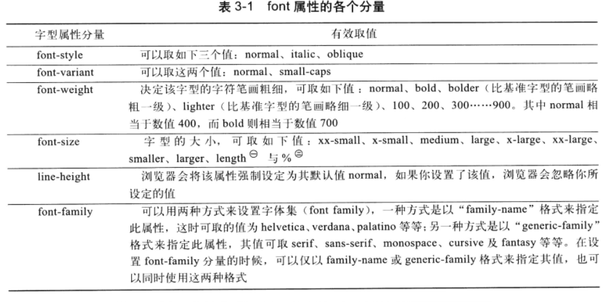
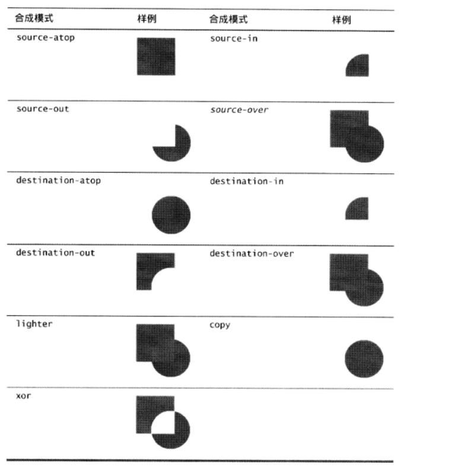

#### canvas元素属性

| 属性| 简介|
|:---------|:------|
|width||
|height||

#### canvas元素方法

| 方法| 简介|
|:---------|:------|
|getContext()||
|toDataURL(type,quality)||
|toBlob(callback,type,args...)||

#### CanvasRenderingContext2D对象所含属性

|属性|简介|
|:------|:------|
|canvas||
|fillStyle||
|strokeStyle||
|font||
|globalAlpha||
|globalCompositeOperation|改变默认的图片合成行为，圆(源物体)，正方形(目标物体)|
|lineCap||
|lineWidth||
|lineJoin||
|miterLimit||
|shadowColor||
|shadowOffsetX||
|shadowOffsetY||
|shadowBlur||
|textAlign|该属性决定了文本在水平方向的对齐方式，有效值：start、left、center、right、end|
|textBaseline|该属性决定了文本在垂直方向上的对齐方式，有效值：top、bottom、middle、alphabetic、ideographic、hanging|

#### CanvasRenderingContext2D方法

| 方法|简介 ||
|:---------|:------|:------|
|save()||
|restore()||
|fillRect()||
|fillText()||
|fill()||
|strokeRect()||
|strokeText()||
|stroke()||
|measureText()||
|clearRect()||
|createLinearGradient(double x0,double y0,double x1,double y1)|创建线性渐变，传入方法的参数表示渐变线的两个断电， 该方法返回一个CanvasGradient实例，可以通过 CanvasGradient.addColorStop()方法来向该渐变色 增加颜色停止点gradient.addColorStop(0,'blue')...5个|
|createRadialGradient()|创建放射性渐变，该方法参数代表 位于圆锥形渐变区两端的圆形， 与createLinearGradient方法一样，返回CanvasGradient实例|
|createPattern(image,repeatString)|创建一个可以用来在canvas之中对图形 和文本进行描边和填充的图案 该方法第一个参数指定了图案所用的图像 它可以是image元素，canvas元素或者video元素； 第二个参数告诉浏览器对图形进行描边 或填充时如何重复图案,有效值repeat、repeat-x、repeat-y、no-repeat|
|beginPath()||
|closePath()||
|isPointInPath()||
|moveTo()||
|lineTo()||
|drawImage(image,sx,sy,sw,sh,dx,dy,dw,dh)|"s"开头源图像，"d"开头表示目标canvas drawImage(image,dx,dy) drawImage(image,dx,dy,dw,dh) drawImage(image,sx,sy,sw,sh,dx,dy,dw,dh)|
|getImageData()||
|putImageData()||
|rect()||
|arc()||
|arcTo()||
|quadraticCurveTo()|二次贝塞尔曲线,曲线控制点坐标，锚点坐标|
|bezierCurveTo()|三次贝塞尔曲线，曲线控制点坐标，曲线控制点坐标，锚点坐标
|translate(x,y)|移动坐标原点|
|rotate()|旋转|
|scale()|缩放|
|shear()|错切|
|transform()|当前变换矩阵叠加运用指定的变换效果|
|setTransform()|将当前变换矩阵设置为默认的单位矩阵|
|clip|剪辑区域|